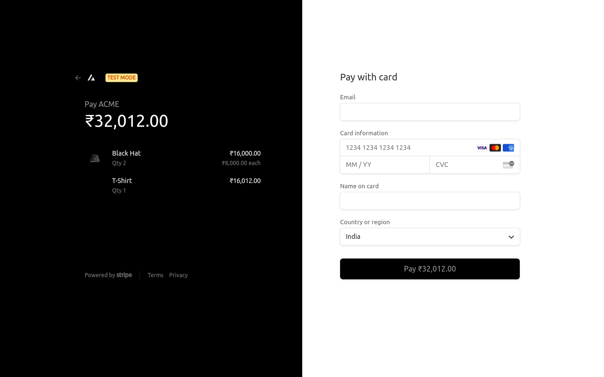
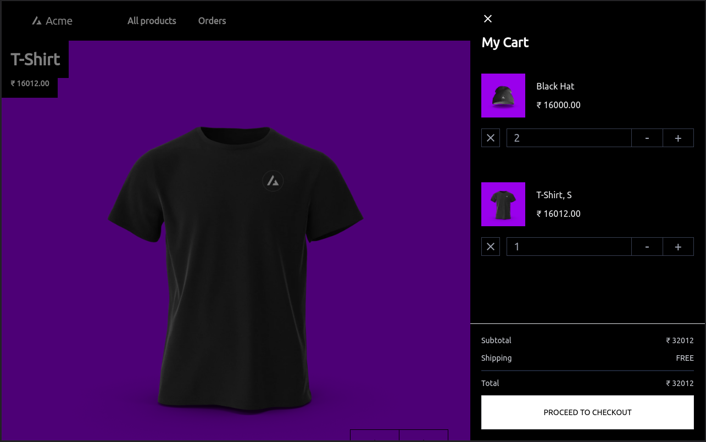

<h1 align="center">Welcome to ACME clothing store 👋</h1>
<p>
  
  <a href="https://github.com/VandanRogheliya/ACME-e-comm-Nextjs/blob/master/LICENSE" target="_blank">
    
  </a>
</p>

> An e-commerce clothing website built using nextjs, firebase and stripe.

### ✨ [Demo](https://acmestore.vercel.app/)

### :hammer_and_wrench: Tools

- :rocket: [NextJS](https://nextjs.org/)
- :bank: [Stripe](https://stripe.com/)
- :evergreen_tree: [TypeScript](https://www.typescriptlang.org/)
- :fire: [Firestore](https://firebase.google.com/docs/firestore)
- :beginner: [Firebase auth](https://firebase.google.com/docs/auth)
- :nail_care: [TailwindCSS](https://tailwindcss.com/)

### :gift: Features

#### :bust_in_silhouette: Google OAuth2

#### :credit_card: Card checkout


- Users can purchase items using their card (Currently it is kept in test mode, so no real transactions :see_no_evil:)
- Test card number: `4242 4242 4242 4242`

#### 🛒 Interact cart


#### :iphone: Responsive

## Install

1. Install dependencies

```sh
yarn
```

2. Copy `.env.local` template

```sh
cp .env.local.example .env.local
```

3. Add firebase and stripe keys to `.env.local`

## Develop

```sh
yarn dev
```

## Authors

:sunglasses: **Vandan**

:sunglasses: **Steve**

- Github: [@VandanRogheliya](https://github.com/VandanRogheliya) and [@stevenovak123](https://github.com/stevenovak123)

## 🤝 Contributing

Contributions, issues and feature requests are welcome!<br />Feel free to check [issues page](https://github.com/VandanRogheliya/ACME-e-comm-Nextjs/issues).

## Show your support

Give a ⭐️ if this project helped you!

## 📝 License

Copyright © 2021 [Vandan](https://github.com/VandanRogheliya) and [Steve](https://github.com/stevenovak123).<br />
This project is [MIT](https://github.com/VandanRogheliya/ACME-e-comm-Nextjs/blob/master/LICENSE) licensed.
